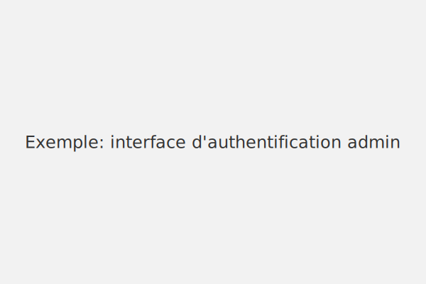
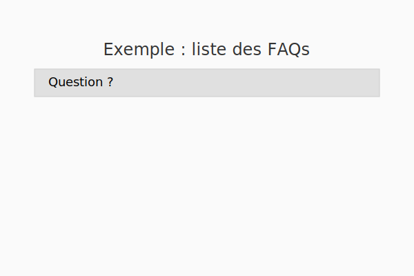

# EchoGIS1.APP

**Plateforme autonome de concertation et de consultation FAQ**  
Développée pour le 1er groupement d'incendie et de secours (BSPP)

---

## 🧭 Objectif du projet

Cette application vise à :
- Centraliser les questions/réponses issues des réunions de concertation
- Permettre leur consultation rapide par mots-clés et filtres
- Extraire automatiquement les Q/R depuis des PV Word ou PDF
- Afficher dynamiquement les dates à venir des réunions de CPUE
- Être utilisée localement sans base de données ni droits administrateur

---

## 📁 Structure du projet

```bash
📦 EchoGIS1.APP/
 ┣ 📂 src/                # Code source React/TypeScript
 ┃ ┣ 📂 components/       # Composants de l’interface
 ┃ ┣ 📂 utils/            # Fonctions utilitaires
 ┃ ┣ 📂 types/            # Définitions de types
 ┃ ┣ 📜 App.tsx
 ┃ ┗ 📜 main.tsx
 ┣ 📂 docs/               # Version compilée pour publication
 ┣ 📜 index.html          # Point d’entrée Vite
 ┣ 📜 package.json        # Dépendances et scripts
 ┣ 📜 README.md           # Documentation
 ┗ 📜 LICENSE.txt
```

## 🚀 Installation rapide

```bash
npm install
npm run dev   # lancement en développement
npm run build # génération de la version de production
```

La version générée se trouve dans `dist/` et peut être copiée dans `docs/` pour une mise en ligne via GitHub Pages.

## 🔐 Mode administrateur

Le mode administrateur (code par défaut `pompiers`) permet :
- d’ajouter, modifier ou supprimer des questions/réponses ;
- de gérer les paramètres de l’application (dates de réunions, etc.) ;
- d’importer ou exporter les données au format JSON, DOCX ou PDF.

### Aperçu





